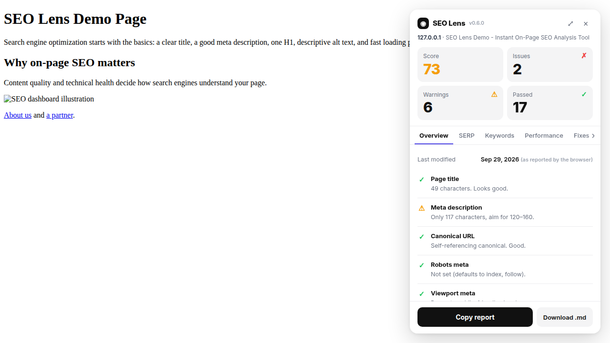
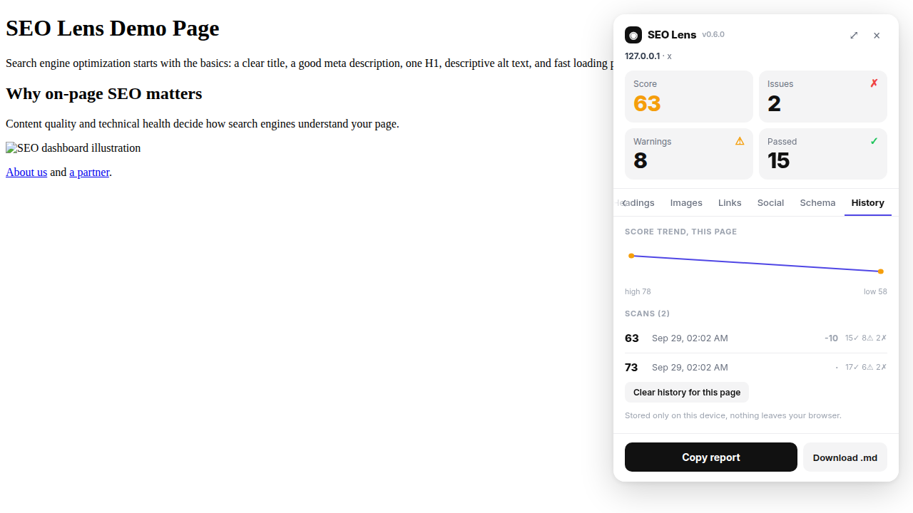

# SEO Lens

One click. A full SEO X-ray of any page: meta tags, headings, images, links, social cards, structured data, performance, and a 0-100 score. Everything is computed locally from the live page. No accounts, no tracking, no sample data. Every number you see came from the page in front of you.

## Features

| Tab | What you get |
|-----|--------------|
| **Overview** | Score ring, title/URL, last-modified (as reported by the browser), and a plain-English verdict |
| **SERP** | Live Google-style preview of title, URL, and description, with truncation warnings |
| **Keywords** | Top keywords and 2-word phrases from visible text only, with placement check (title, H1, description) |
| **Performance** | LCP, CLS, TTFB, page weight, request count, plus one-click PageSpeed Insights (mobile/desktop) |
| **Fixes** | Prioritized, page-specific fix list, and a "Highlight issues on page" toggle that outlines problems right on the site |
| **Headings** | Full H1-H6 outline with skipped-level detection |
| **Images** | Every image with alt-text status and oversized-image detection |
| **Links** | Internal/external/nofollow breakdown, broken-link checking |
| **Social** | Open Graph and Twitter Card validation |
| **Schema** | JSON-LD structured data found on the page |
| **History** | Score trend per page: sparkline, per-scan deltas, pass/warn/fail counts |

Also included: copy-as-Markdown and download-as-.md report export.

## The score

The 0-100 score covers **stable on-page checks only**: titles, meta description, headings, images, links, canonical, HTTPS, viewport, robots directives, social tags, and structured data.

Deliberately **excluded from scoring** (still reported, for reference): performance timings, page weight, request counts, robots.txt/sitemap reachability, and broken-link results. These vary between reloads, so they would make the score jump around. The score stays consistent; the volatile stuff is shown separately.

## Score history

Every scan is saved automatically to `chrome.storage.local` on your device. Rescans within 30 minutes are skipped unless the score changed, and each page keeps its last 50 scans. The History tab shows a trend sparkline, the delta vs. the previous scan, and check counts. One click clears a page's history. Nothing ever leaves your browser.

## Install

**Chrome / Edge / Brave**

1. Download the latest [release](https://github.com/MohammadUmar-001/Seo-lens/releases) (or clone this repo).
2. Open `chrome://extensions` and enable **Developer mode**.
3. Click **Load unpacked** and select the folder.
4. Click the toolbar icon on any page.

**Firefox**

MV3 is supported in recent versions. Use `about:debugging` -> This Firefox -> Load Temporary Add-on, then pick `manifest.json`.

## Privacy

- All analysis runs locally in the browser against the live DOM.
- Score history lives in `chrome.storage.local`, device only.
- The only network calls are the ones the page itself would trigger (robots.txt/sitemap checks, plus the PageSpeed buttons you click).
- Permissions: `activeTab`, `scripting`, `clipboardWrite`, `storage`, plus host access to `https://www.googleapis.com/` only for the inline PageSpeed tests. Nothing more.

## Development

The panel is vanilla JS + CSS in a Shadow DOM (no frameworks, no build step). Edit and reload the extension to test.

- `manifest.json` - MV3 manifest, toolbar action
- `background.js` - service worker, injects the scraper + panel
- `scraper.js` - all page analysis, runs in the page context
- `panel.js` / `panel.css` - floating Shadow DOM panel UI
- `test-fixture.html` - local test page (not shipped in releases)

## Changelog

**v0.6.1**
- PageSpeed tests now run inline: the Performance tab shows Google's lab scores (Performance, Accessibility, Best practices, SEO) plus Core Web Vitals right in the panel, no new tab needed. Optional free API key field for reliable tests, keyless tests use Google's shared quota
- Subtle fade-up animation when switching tabs
- Key/value rows now wrap at word boundaries and left-align their values
- Removed the header logo icon; nothing in the UI uses a font weight above 600 anymore

**v0.6.0**
- Full UI redesign in an audit-card style: 2x2 stat grid (Score / Issues / Warnings / Passed), underline tab strip, status-icon check rows, code snippet boxes, and a black Copy report button
- New wide-panel toggle in the header
- Fix suggestions now carry their severity, shown as red or amber icons

**v0.5.4**
- Removed every em dash from UI strings and docs
- README overhaul

**v0.5.3**
- New History tab: per-page score trend with sparkline, per-scan deltas, and pass/warn/fail counts. Stored in `chrome.storage.local`, device only. Needs the `storage` permission.

**v0.5.2**
- Fixed Inter font not loading (Chrome ignores `@font-face` inside Shadow DOM, so faces are now installed at document level)
- Overview shows "Last modified" from `document.lastModified`, labeled as browser-reported
- PageSpeed Insights mobile/desktop buttons in the Performance tab
- "Highlight issues on page" toggle in the Fixes tab (red for errors, orange for warnings, fully reversible)

**v0.5.1**
- Full truthfulness audit: fixed 12 checks that could mislead (noindex verdict, robots.txt user-agent groups, `javascript:`/`mailto:` links, hidden-text keywords, relative canonicals/og:images, srcset mixed content, SVG text in headings)
- Panel moved to top-right with scroll isolation

**v0.5.0**
- Rebuilt keyword engine: visible-text-only extraction, 2-word phrases, placement checks, honest word count

## License

MIT. See [LICENSE](LICENSE).
